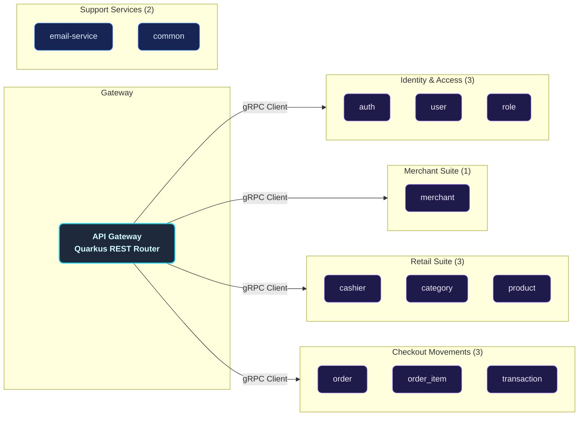
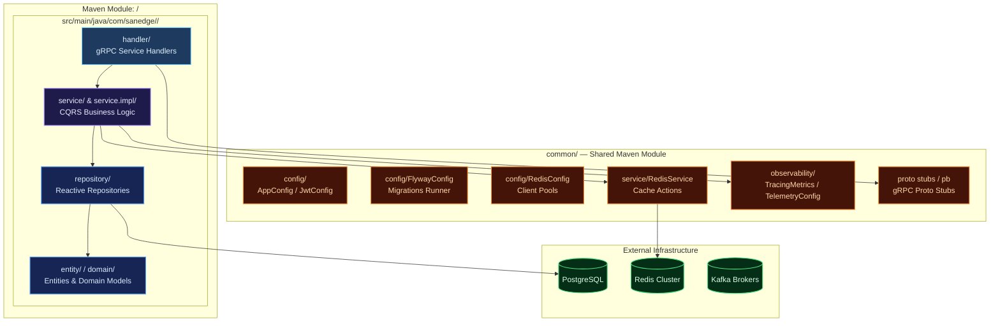
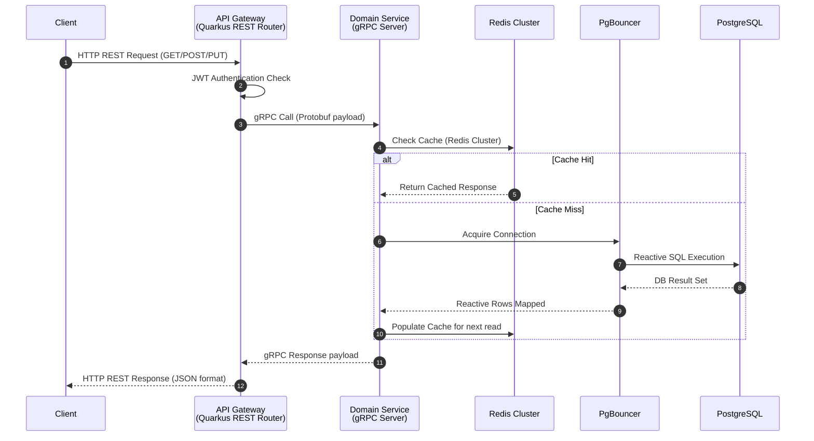
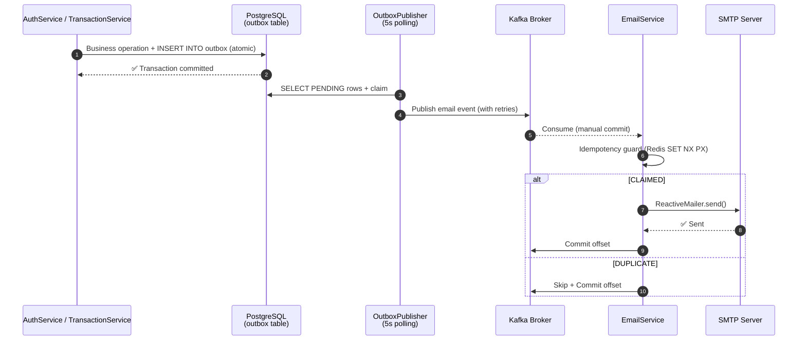
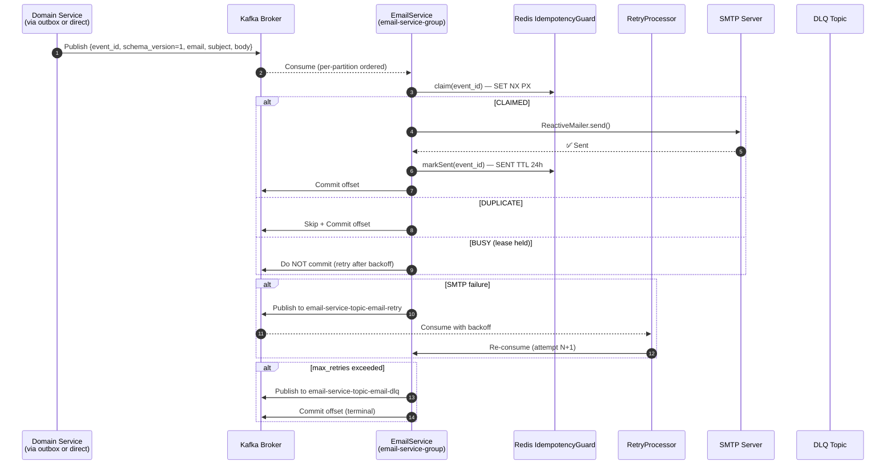
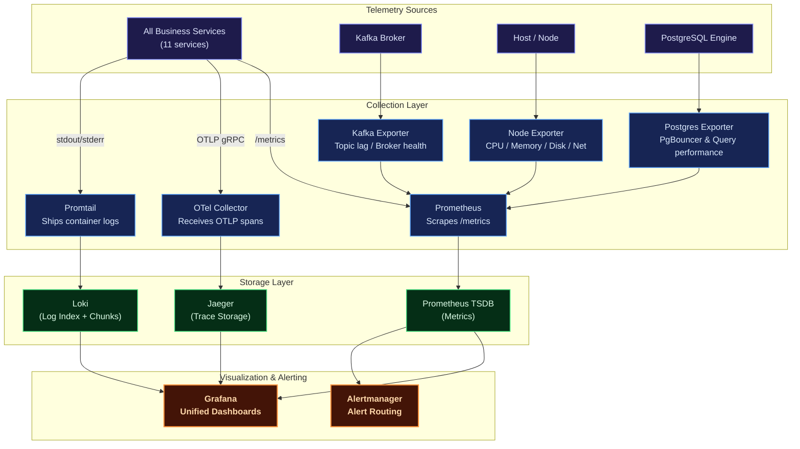
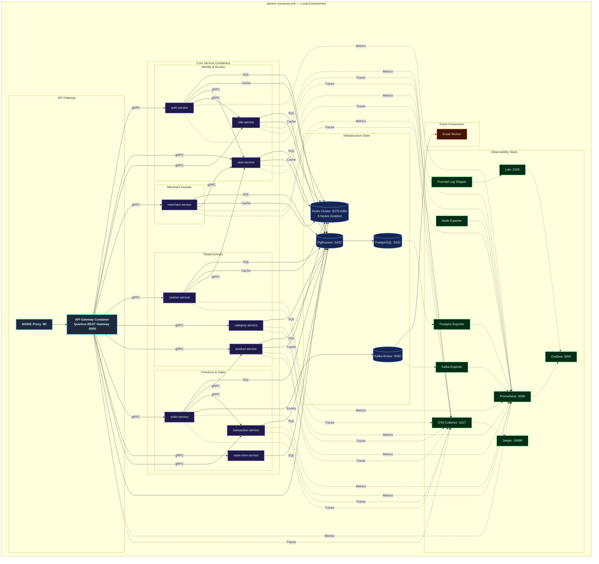

# Distributed Modular Monolith — Point of Sale Platform (Java Quarkus)

A production-grade, highly resilient, and fully observable **modular-monolith point of sale (POS) backend** built in **Java 21** using **Quarkus** reactive framework (v3.31.3). Designed around domain-driven service boundaries following Clean Architecture and CQRS principles, it retains the operational and deployment simplicity of a single deployment unit while maintaining logical isolation typical of microservices.

Each retail and identity business domain — Users, Roles, Cashiers, Merchants, Categories, Products, Orders, Order Items, Transactions — lives in its own self-contained Maven module. These modules communicate synchronously via high-performance **gRPC** protocols and asynchronously using **Apache Kafka** event propagation, exposing a unified reactive entry point through a **REST API Gateway** powered by Quarkus RESTEasy Reactive.

The platform is fortified with a **comprehensive observability suite** (Prometheus, Grafana, Loki, Jaeger, OpenTelemetry), robust connection pooling via **PgBouncer**, **distributed Redis Cluster caching** with custom telemetry for each service, and Kubernetes configurations ready for production auto-scaling.

---

## Key Features

| Domain             | Capabilities                                                                                                                                                                                              |
| :----------------- | :-------------------------------------------------------------------------------------------------------------------------------------------------------------------------------------------------------- |
| **Auth & Users**   | Secure registration, multi-factor login, stateless JWT access/refresh token lifecycle, password reset workflows, OTP email verification, and `/me` profile REST endpoint.                                 |
| **Roles & RBAC**   | Custom permission configuration, granular access control matrices, and sub-second permission evaluation cached via Redis.                                                                                 |
| **Merchants**      | Fully featured merchant onboarding, profile details management, business data registration, and merchant performance/transaction reports with full data restoration capabilities (soft delete & restore). |
| **Cashiers**       | Staff management per merchant, cashier activity tracking, sales performance analysis, and daily/monthly sales volume reporting.                                                                           |
| **Categories**     | Product taxonomy categorizations with soft-delete capabilities and quick search filters.                                                                                                                  |
| **Products**       | Inventory management, count in stock tracking, brand details, price structures, and multi-dimensional search filters (merchant, price range, brand, category).                                            |
| **Orders & Items** | Ledger checkout transactions, multi-item baskets with product price lookups, real-time total updates, monthly/yearly total revenue analytics, and sold-out product tracking.                              |
| **Transactions**   | Central financial audit register, global search filters, status tracking, monthly/yearly volume reports, and merchant/cashier sales breakdown.                                                            |
| **Email Worker**   | Kafka-driven asynchronous worker dispatching critical notification emails (OTPs, login alerts, merchant onboarding notices, and order receipts/invoices) via SMTP.                                        |
| **Observability**  | Multi-dimensional metrics (Prometheus + Grafana), log aggregation (Loki + Logback), end-to-end distributed tracing (Jaeger + OpenTelemetry), and resource monitors (Node, Kafka, Postgres Exporters).     |
| **Deployment**     | Local orchestration using Docker Compose (featuring a 6-node Redis Cluster and PgBouncer), and auto-scaling Kubernetes manifests configured with Horizontal Pod Autoscalers (HPA).                        |

---

## Architecture Overview

The platform implements a **Distributed Modular Monolith** architecture. Each business service is logical, decoupled, and self-contained inside its own Maven submodule, possessing its own independent gRPC boundary. A **Quarkus REST API Gateway** acts as the unified edge router, transforming client HTTP REST requests into fast gRPC downstream communications via Quarkus gRPC clients.

### Core Architecture Principles

- **Domain-Driven Boundary Isolation**: Every service owns its database access, caching layers, and service logic, strictly forbidding cross-boundary database sharing.
- **Clean Architecture & CQRS**: Separation of concerns using `Handler (gRPC) → Service (Command/Query) → Repository (Command/Query)` layers ensures business logic remains clean, performant, and framework-agnostic.
- **Reactive execution**: Powered entirely by Quarkus reactive engine and Mutiny, enabling high throughput with minimal resource footprints.
- **PgBouncer Pooling**: Employs connection pooling to avoid PostgreSQL socket exhaustion across the multiple concurrent modular services.
- **Event-Driven Resilience**: Apache Kafka decouples transaction events, ensuring side effects like email billing remain completely non-blocking.
- **OTel Telemetry Integration**: Standardized OpenTelemetry middleware injects trace IDs across gRPC boundaries, allowing seamless trace propagation from the client REST gateway down to postgres operations.

```mermaid
graph TB
    classDef client fill:#0f172a,stroke:#38bdf8,color:#e0f2fe,stroke-width:2px,font-weight:bold
    classDef gateway fill:#1e293b,stroke:#22d3ee,color:#cffafe,stroke-width:2px,font-weight:bold
    classDef domain fill:#1e1b4b,stroke:#818cf8,color:#e0e7ff,stroke-width:1.5px
    classDef infra fill:#172554,stroke:#60a5fa,color:#dbeafe,stroke-width:1.5px
    classDef obs fill:#052e16,stroke:#4ade80,color:#dcfce7,stroke-width:1.5px
    classDef event fill:#431407,stroke:#fb923c,color:#fed7aa,stroke-width:1.5px

    Client["Client Applications<br/>(Web / Mobile / API)"]:::client

    subgraph APIGateway["API Gateway — NGINX + Quarkus REST Gateway"]
        direction LR
        REST["REST API Route Handler<br/>Port :5000"]:::gateway
        AuthMW["JWT Auth & Role<br/>Middleware"]:::gateway
    end

    Client -->|HTTP REST| APIGateway

    subgraph BusinessServices["Business Domain Services (Java Quarkus)"]
        direction TB

        subgraph IdentityDomain["Identity & Access"]
            AUTH["Auth Service<br/>JWT & BCrypt Server"]:::domain
            USER["User Service<br/>Profile Management"]:::domain
            ROLE["Role Service<br/>RBAC & Permissions"]:::domain
        end

        subgraph MerchantDomain["Merchant Management"]
            MERCH["Merchant Service<br/>Onboarding & Profiling"]:::domain
        end

        subgraph RetailDomain["Retail & Inventory Suite"]
            CASHIER["Cashier Service<br/>Staff & Sales Tracker"]:::domain
            CATEGORY["Category Service<br/>Product Taxonomy"]:::domain
            PRODUCT["Product Service<br/>Catalog & Inventory"]:::domain
        end

        subgraph OrderDomain["Checkout & Transactions"]
            ORDER["Order Service<br/>Checkout & Sales Ledger"]:::domain
            ORDER_ITEM["OrderItem Service<br/>Basket Details"]:::domain
            TXN["Transaction Service<br/>Central Audit Register"]:::domain
        end
    end

    REST -->|"Quarkus gRPC Client"| AUTH
    REST -->|"Quarkus gRPC Client"| USER
    REST -->|"Quarkus gRPC Client"| ROLE
    REST -->|"Quarkus gRPC Client"| MERCH
    REST -->|"Quarkus gRPC Client"| CASHIER
    REST -->|"Quarkus gRPC Client"| CATEGORY
    REST -->|"Quarkus gRPC Client"| PRODUCT
    REST -->|"Quarkus gRPC Client"| ORDER
    REST -->|"Quarkus gRPC Client"| ORDER_ITEM
    REST -->|"Quarkus gRPC Client"| TXN

    subgraph Infrastructure["Infrastructure Layer"]
        direction LR
        PGBOUNCER["PgBouncer<br/>Connection Pooler :6432"]:::infra
        PG[("PostgreSQL<br/>POINT_OF_SALE DB")]:::infra
        REDIS[("Redis Cluster<br/>6-Node Distributed Cache")]:::infra
        KAFKA[("Kafka Broker<br/>Event Bus")]:::infra
    end

    AUTH -->|"Reactive SQL Client"| PGBOUNCER
    USER -->|"Reactive SQL Client"| PGBOUNCER
    ROLE -->|"Reactive SQL Client"| PGBOUNCER
    MERCH -->|"Reactive SQL Client"| PGBOUNCER
    CASHIER -->|"Reactive SQL Client"| PGBOUNCER
    CATEGORY -->|"Reactive SQL Client"| PGBOUNCER
    PRODUCT -->|"Reactive SQL Client"| PGBOUNCER
    ORDER -->|"Reactive SQL Client"| PGBOUNCER
    ORDER_ITEM -->|"Reactive SQL Client"| PGBOUNCER
    TXN -->|"Reactive SQL Client"| PGBOUNCER

    PGBOUNCER --> PG

    AUTH -->|"Quarkus Redis client"| REDIS
    USER -->|"Quarkus Redis client"| REDIS
    ROLE -->|"Quarkus Redis client"| REDIS
    CASHIER -->|"Quarkus Redis client"| REDIS
    PRODUCT -->|"Quarkus Redis client"| REDIS
    REST -->|"Quarkus Redis client"| REDIS

    subgraph EventConsumers["Event-Driven Consumers"]
        EMAIL["Email Service<br/>SMTP Notification Worker"]:::event
    end

    KAFKA -->|"Consume Events"| EMAIL

    subgraph Observability["Observability Stack"]
        direction LR
        PROM["Prometheus<br/>Metrics Engine"]:::obs
        LOKI["Loki<br/>Log Aggregator"]:::obs
        JAEGER["Jaeger<br/>Distributed Traces"]:::obs
        GRAFANA["Grafana<br/>Unified Dashboards"]:::obs
        OTEL["OTel Collector<br/>Telemetry Pipeline"]:::obs
        PROMTAIL["Promtail<br/>Log Shipper"]:::obs
        NODEX["Node Exporter<br/>System Metrics"]:::obs
        KAFKAX["Kafka Exporter<br/>Broker Metrics"]:::obs
        PGX["Postgres Exporter<br/>DB Performance"]:::obs
    end

    AUTH -->|gRPC| USER
    AUTH -->|gRPC| ROLE
    MERCH -->|gRPC| USER
    CASHIER -->|gRPC| USER
    ORDER -->|gRPC| PRODUCT
    ORDER -->|gRPC| TXN

    AUTH -.->|"Publish Verification Event"| KAFKA
    ORDER -.->|"Publish Order Event"| KAFKA

    AUTH -.->|"/metrics"| PROM
    USER -.->|"/metrics"| PROM
    ROLE -.->|"/metrics"| PROM
    MERCH -.->|"/metrics"| PROM
    CASHIER -.->|"/metrics"| PROM
    CATEGORY -.->|"/metrics"| PROM
    PRODUCT -.->|"/metrics"| PROM
    ORDER -.->|"/metrics"| PROM
    TXN -.->|"/metrics"| PROM
    REST -.->|"/metrics"| PROM

    AUTH -.->|"OTLP Spans"| OTEL
    USER -.->|"OTLP Spans"| OTEL
    ROLE -.->|"OTLP Spans"| OTEL
    MERCH -.->|"OTLP Spans"| OTEL
    CASHIER -.->|"OTLP Spans"| OTEL
    CATEGORY -.->|"OTLP Spans"| OTEL
    PRODUCT -.->|"OTLP Spans"| OTEL
    ORDER -.->|"OTLP Spans"| OTEL
    TXN -.->|"OTLP Spans"| OTEL
    REST -.->|"OTLP Spans"| OTEL

    OTEL -.-> JAEGER
    PROMTAIL -.-> LOKI
    NODEX -.-> PROM
    KAFKAX -.-> PROM
    PGX -.-> PROM
    PROM -.-> GRAFANA
    LOKI -.-> GRAFANA
    JAEGER -.-> GRAFANA
    KAFKA -.-> KAFKAX
    PG -.-> PGX
```



---

## Service Catalog

The modular architecture consists of **12 logical micro-applications** plus supporting database and migrations:



---

## Internal Service Architecture

Every logical business service is mapped as a decoupled submodule following structured clean architecture rules.



---

## Data & Event Flow

### Synchronous Flow (REST Proxy & Cache Read-Through)

All external client API requests go through the REST endpoints defined in the Quarkus API Gateway Router. The API Gateway validates the JWT/API Key, connects with the correct downstream gRPC modular server, checks the Redis Cluster cache, and fetches PostgreSQL through PgBouncer if a cache miss occurs.



### Asynchronous Flow (Kafka Event Pipeline)

The platform uses **Apache Kafka (KRaft mode)** as its event backbone for **email notifications** (8 domain-specific topics) dispatched through the `EmailService`. All producers use the **Vert.x Kafka client** (`io.vertx.kafka.client.producer.KafkaProducer`) integrated through Quarkus, with `acks=all`, idempotent producers, and SASL/TLS support. The **transactional outbox pattern** (`OutboxPublisher` in auth and transaction) guarantees at-least-once delivery even during broker outages.

#### Kafka Topics Registry

| # | Topic | Producer Service | Consumer Service | Consumer Group | Commit Mode | Purpose |
|---|---|---|---|---|---|---|
| 1 | `email-service-topic-auth-register` | auth (outbox) | email-service | `email-service-group` | Manual | Registration welcome email |
| 2 | `email-service-topic-auth-forgot-password` | auth (outbox) | email-service | `email-service-group` | Manual | Password reset OTP email |
| 3 | `email-service-topic-auth-verify-code-success` | auth | email-service | `email-service-group` | Manual | Email verification success |
| 4 | `email-service-topic-transaction-create` | transaction (outbox) | email-service | `email-service-group` | Manual | Transaction receipt/invoice email |
| 5 | `email-service-topic-merchant-create` | merchant | email-service | `email-service-group` | Manual | Merchant onboarding welcome |
| 6 | `email-service-topic-merchant-update-status` | merchant | email-service | `email-service-group` | Manual | Merchant status change notification |
| 7 | `email-service-topic-merchant-document-create` | merchant | email-service | `email-service-group` | Manual | Merchant document upload notification |
| 8 | `email-service-topic-merchant-document-update-status` | merchant | email-service | `email-service-group` | Manual | Merchant document status change |
| 9 | `email-service-topic-email-retry` | email-service | RetryProcessor | `email-service-group` | Manual | Bounded retry queue (max 3 attempts, exponential backoff) |
| 10 | `email-service-topic-email-dlq` | email-service | — | — | — | Dead-letter queue (terminal failure sink) |

> **Total: 10 Kafka topics** (8 email notification + 2 email infrastructure)

#### Kafka Producer Architecture

Every service that publishes to Kafka (auth, merchant, order, transaction) has its own `KafkaService` bean wrapping a `KafkaProducer<String, String>`. The common producer features:

- **Idempotent producer** (`acks=all`, `enable.idempotence=true`) for exactly-once semantics
- **W3C Traceparent injection** — `traceparent` header injected into every record for end-to-end distributed tracing
- **Chaos Engineering integration** — the chaos manager evaluates a `kafka` policy per topic and can simulate message drops, rejections, or artificial latency
- **Centralized config** — `KafkaConfig.producer()` in `common/` module ensures identical settings across all services

```java
// Standard producer lifecycle (auth, merchant, order, transaction)
@Inject Vertx vertx;
private volatile KafkaProducer<String, String> producer;

@PostConstruct
void init() {
    Map<String, String> config = KafkaConfig.producer(
        bootstrapServers, acks, idempotence, KafkaSecurity.fromEnv());
    producer = KafkaProducer.create(vertx, config);
}
```

#### Transactional Outbox Pattern

The **auth** and **transaction** services implement the **transactional outbox pattern** for reliable event publishing. Events are first written to an outbox table (PostgreSQL) within the same transaction as the business operation, then a scheduled poller (`Vertx.setPeriodic(5000ms)`) publishes them to Kafka with at-least-once guarantees:



Key outbox guarantees:
- **Atomic writes** — business operation and outbox insert share the same DB transaction
- **Fixed-interval polling** — `Vertx.setPeriodic(5000ms)` polls, claims, and publishes sequentially
- **Max attempts** — events exceeding `outbox.publisher.max-attempts` (default: 5) are marked FAILED (dead letter)
- **Backlog metrics** — `outbox_published_total` and `outbox_failed_total` counters exposed via OTel

#### Email Notification Flow

The email worker (`EmailService.java`) is a single consumer subscribing to all 8 notification topics. Key delivery guarantees:

- **Manual commit** — offsets are committed only after a terminal outcome (sent, retry published, or DLQ published)
- **Per-partition ordering** — `partitionTails` map ensures records within a partition are processed sequentially
- **Idempotency** — Redis-backed `EmailDedupGuard` claims `email:idempotency:<event_id>` atomically with a lease (fail-open if Redis is unavailable)
- **Bounded retry** — failed SMTP sends are re-published to `email-service-topic-email-retry` with exponential backoff (30s base, 5-minute cap), up to `email.retry.max-attempts` (default: 3)
- **Dead-letter queue** — exhausted retries move to `email-service-topic-email-dlq` (shared across all topics)
- **Per-partition consumer lag** — exposed as OTel gauge `kafka_consumer_lag{group, partition}`
- **Distributed tracing** — `traceparent` W3C header extracted from record headers for end-to-end span propagation



#### Kafka Security & Production Configuration

The `KafkaSecurity` record (common module) centralizes SASL/TLS configuration. Domain services use `KafkaConfig.producer()` / `KafkaConfig.consumer()` which auto-applies security settings from `KAFKA_*` env vars:

| Config | Environment Variable | Default | Description |
|---|---|---|---|
| `security.protocol` | `KAFKA_SECURITY_PROTOCOL` | `PLAINTEXT` | Protocol (`PLAINTEXT` / `SASL_SSL`) |
| `sasl.mechanism` | `KAFKA_SASL_MECHANISM` | `SCRAM-SHA-256` | SASL mechanism |
| `sasl.jaas.config` | `KAFKA_SASL_JAAS_CONFIG` | — | JAAS login module config |
| `ssl.truststore.location` | `KAFKA_SSL_TRUSTSTORE_LOCATION` | — | JKS truststore path |
| `ssl.keystore.location` | `KAFKA_SSL_KEYSTORE_LOCATION` | — | JKS keystore path |
| `enable.idempotence` | `KAFKA_IDEMPOTENCE` | `true` | Idempotent producer |
| `acks` | `KAFKA_ACKS` | `all` | Acknowledgement level |

#### Kafka Metrics (OTel)

| Metric | Type | Description |
|---|---|---|
| `email_sent_total` | Counter | Emails successfully sent via SMTP |
| `email_failed_total` | Counter | Email send attempts that failed |
| `email_retried_total` | Counter | Emails routed to the retry topic |
| `email_dlq_total` | Counter | Emails moved to DLQ |
| `email_duplicate_total` | Counter | Duplicate email events skipped |
| `email_invalid_event_total` | Counter | Events rejected for invalid envelope |
| `email_processing_duration_seconds` | Histogram | Email record processing duration |
| `kafka_consumer_lag{group, partition}` | Gauge | Per-partition consumer lag (email group) |
| `outbox_published_total{service}` | Counter | Events published from outbox (auth, transaction) |
| `outbox_failed_total{service}` | Counter | Outbox events that reached max attempts |

---

## Design Decisions & Known Limitations

Keputusan desain yang disengaja (bukan bug) — didokumentasikan agar tim tidak
"memperbaiki" perilaku berikut tanpa sadar:

| ID | Keputusan | Perilaku | Alasan |
|---|---|---|---|
| OT-3 | Status transaksi **tidak terkunci** | `updateTransaction` dapat mengubah `payment_status` kapan pun (dari pending → success/failed dan sebaliknya) tanpa state machine transisi | Audit status tidak dianggap kritikal untuk POS skala ini; mengubahnya menjadi state machine menambah kompleksitas tanpa kebutuhan bisnis eksplisit |
| OT-4 | Edge-case stok saat **trash item eksplisit** setelah trash order | Bila item di-trash eksplisit setelah order di-trash, stok item tersebut **tidak di-decrement** saat order di-restore (hanya item yang masih aktif yang ikut restore) | Perilaku disengaja: restore hanya memproses item aktif; item trash eksplisit adalah keputusan terpisah dari siklus hidup order. Konsekuensi: stok bisa bergeser dari "aktif = stok terpakai" pada skenario ini |
| OT-2 | `amount` transaksi **dihitung ulang server-side** | Nilai `amount` dari client tidak dipercaya; dihitung ulang dari order items + PPN 11% (`totalAmountWithTax`). Klaim yang kurang → `"Insufficient payment amount"` | Mencegah manipulasi nilai transaksi oleh client |

**Catatan Fase 11–15 (2026-08-14):** lihat `SUPER_PLANNING_MASTER.md` untuk
checklist lengkap — transactional outbox + retry/DLQ (F11), idempotency key
transaksi (F12), chaos & tracing Kafka (F13), SASL/TLS + acks=all + idempotent
producer (F14), serta order stats by-id & OTP REST (F15).

---

## Observability Architecture



| Pillar       | Tool                   | Purpose                                                                                         |
| :----------- | :--------------------- | :---------------------------------------------------------------------------------------------- |
| **Metrics**  | Prometheus + Grafana   | Core metrics tracking (CPU, memory, request error rates, gRPC latencies, DB connection states). |
| **Logging**  | Loki + Logback         | Centralized structured JSON logger for indexing logs by service, queryable via LogQL.           |
| **Tracing**  | OpenTelemetry + Jaeger | Distributed system tracing across API gateway and internal gRPC services.                       |
| **Alerting** | Alertmanager           | Automated notification system triggered during latency hikes or service disconnects.            |

## Chaos Engineering Platform

The payment gateway features a built-in **reactive Chaos Engineering engine** to continuously test system resilience under failure conditions (database spikes, slow endpoints, CPU stress, and memory leaks).

### How It Works

The chaos engine is managed by [ChaosManager.java](./common/src/main/java/com/sanedge/common/chaos/ChaosManager.java) which dynamically watches the configuration file [chaos.yaml](./chaos.yaml) for modifications:

- **Dynamic Hot-Reloading**: Every 5 seconds, the engine checks `chaos.yaml` for changes. Adjusting values or toggling policies will update the running system instantly without requiring a service restart.

### Injection Mechanisms

1. **HTTP Routing Chaos** ([ChaosHttpMiddleware.java](./common/src/main/java/com/sanedge/common/chaos/ChaosHttpMiddleware.java)): Intercepts API router entry points to inject specified latency hikes or HTTP errors (e.g., status code 429 - rate limits).
2. **Database SQL Chaos** ([ChaosSqlProxy.java](./common/src/main/java/com/sanedge/common/chaos/ChaosSqlProxy.java)): Wraps database clients in a dynamic proxy, injecting database transaction latency or simulating sudden lock wait timeouts/deadlocks when queries hit matching tables.
3. **Resource Stress Chaos** ([ChaosResourceSabotage.java](./common/src/main/java/com/sanedge/common/chaos/ChaosResourceSabotage.java)): Spawns CPU/memory pressure routines to simulate container hardware throttling or memory exhaustion.

---

## Deployment Architectures

### Docker Compose (Local Development)

The Docker Compose configuration provisions a 6-node Redis Cluster along with databases, event brokers, and reactive service containers to replicate a microservices environment.



---

### Kubernetes (Production Clustering)

The production-grade Kubernetes architecture is designed for high availability, fault tolerance, and seamless horizontal scaling. All manifests are defined inside the custom `point-of-sale` namespace, route edge traffic using NGINX pods acting as a LoadBalancer, and manage service scalability using individual HPAs.

```mermaid
flowchart TB
    classDef client fill:#0f172a,stroke:#38bdf8,color:#e0f2fe,stroke-width:2px,font-weight:bold
    classDef ingress fill:#0f172a,stroke:#06b6d4,color:#e0f7fa,stroke-width:2px,font-weight:bold
    classDef k8sSvc fill:#1e293b,stroke:#22d3ee,color:#cffafe,stroke-width:2px,font-weight:bold
    classDef pod fill:#1e1b4b,stroke:#a78bfa,color:#ede9fe,stroke-width:1.5px
    classDef stateful fill:#172554,stroke:#60a5fa,color:#dbeafe,stroke-width:1.5px
    classDef hpa fill:#064e3b,stroke:#34d399,color:#ecfdf5,stroke-width:1px,stroke-dasharray: 5 5
    classDef obs fill:#052e16,stroke:#4ade80,color:#dcfce7,stroke-width:1.5px

    Client["Client Applications<br/>(HTTPS Requests)"]:::client

    subgraph K8sCluster["Kubernetes Cluster — Namespace: point-of-sale"]
        direction TB

        subgraph IngressLayer["Edge Reverse Proxy (NGINX)"]
            NGINX_SVC["nginx-service<br/>(LoadBalancer :80)"]:::k8sSvc
            NGINX_POD["nginx-pods"]:::pod
        end

        subgraph GatewayServices["REST API Gateway (Scalable Deployment)"]
            APIGW_SVC["apigateway-service<br/>(ClusterIP :5000)"]:::k8sSvc
            APIGW_PODS["apigateway-pods"]:::pod
            APIGW_HPA["apigateway-hpa"]:::hpa
        end

        subgraph DomainServices["Internal gRPC Microservices"]
            direction TB

            subgraph IdentityZone["Identity Suite"]
                AUTH_POD["auth-pods"]:::pod
                USER_POD["user-pods"]:::pod
                ROLE_POD["role-pods"]:::pod
                AUTH_SVC["auth-service (gRPC)"]:::k8sSvc
                USER_SVC["user-service (gRPC)"]:::k8sSvc
                ROLE_SVC["role-service (gRPC)"]:::k8sSvc
            end

            subgraph MerchantZone["Merchant Suite"]
                MERCH_POD["merchant-pods"]:::pod
                MERCH_SVC["merchant-service (gRPC)"]:::k8sSvc
            end

            subgraph RetailZone["Retail & Taxonomy"]
                CASHIER_POD["cashier-pods"]:::pod
                CATEGORY_POD["category-pods"]:::pod
                PRODUCT_POD["product-pods"]:::pod
                CASHIER_SVC["cashier-service (gRPC)"]:::k8sSvc
                CATEGORY_SVC["category-service (gRPC)"]:::k8sSvc
                PRODUCT_SVC["product-service (gRPC)"]:::k8sSvc
            end

            subgraph MovementsZone["Ledgers & Orders"]
                ORDER_POD["order-pods"]:::pod
                TX_POD["transaction-pods"]:::pod
                ORDER_SVC["order-service (gRPC)"]:::k8sSvc
                TX_SVC["transaction-service (gRPC)"]:::k8sSvc
            end

            PodsHPA["Domain Services HPAs<br/>(auth, product, order, etc.)"]:::hpa
        end

        subgraph DataObservability["Infrastructure & Databases"]
            PGB_SVC["pgbouncer-service<br/>(ClusterIP :6432)"]:::k8sSvc
            PGB_POD["pgbouncer-pods"]:::pod

            PG_SVC["postgres-service<br/>(ClusterIP :5432)"]:::k8sSvc
            PG_POD["postgres-pods"]:::pod

            REDIS_SVC["redis-cluster-service<br/>(ClusterIP :6379)"]:::k8sSvc
            REDIS_SET[("redis-cluster StatefulSet<br/>(6-Node Shards)")]:::stateful

            KAFKA_SVC["kafka-service<br/>(ClusterIP :9092)"]:::k8sSvc
            KAFKA_POD["kafka-pods"]:::pod
        end

        subgraph BackgroundWorkers["Event Consumers"]
            EMAIL_SVC["email-service<br/>(ClusterIP)"]:::k8sSvc
            EMAIL_PODS["email-pods"]:::pod
            EMAIL_HPA["email-hpa"]:::hpa
        end

        subgraph K8sObs["Observability Namespace Suite"]
            PROM_SVC["prometheus-service<br/>(ClusterIP :9090)"]:::k8sSvc
            PROM_POD["prometheus-pod"]:::pod

            OTEL_SVC["otel-collector-service<br/>(ClusterIP :4317)"]:::k8sSvc
            OTEL_POD["otel-collector-pod"]:::pod

            LOKI_SVC["loki-service<br/>(ClusterIP :3100)"]:::k8sSvc
            LOKI_POD["loki-pod"]:::pod

            JAEGER_SVC["jaeger-service<br/>(ClusterIP :16686)"]:::k8sSvc
            JAEGER_POD["jaeger-pod"]:::pod

            GRAFANA_SVC["grafana-service<br/>(ClusterIP :3000)"]:::k8sSvc
            GRAFANA_POD["grafana-pod"]:::pod

            ALERTMGR_SVC["alertmanager-service<br/>(ClusterIP :9093)"]:::k8sSvc
            ALERTMGR_POD["alertmanager-pod"]:::pod

            PROMTAIL["promtail-daemonset"]:::pod

            KAFKAX_SVC["kafka-exporter-service"]:::k8sSvc
            KAFKAX_POD["kafka-exporter-pod"]:::pod

            NODEX_SVC["node-exporter-service"]:::k8sSvc
            NODEX_POD["node-exporter-daemonset"]:::pod
        end
    end

    Client -->|HTTPS :443| NGINX_SVC
    NGINX_SVC --> NGINX_POD
    NGINX_POD -->|Proxy Pass| APIGW_SVC
    APIGW_SVC --> APIGW_PODS
    APIGW_HPA -.->|Autoscales| APIGW_PODS

    APIGW_PODS -->|gRPC call| AUTH_SVC
    APIGW_PODS -->|gRPC call| USER_SVC
    APIGW_PODS -->|gRPC call| ROLE_SVC
    APIGW_PODS -->|gRPC call| MERCH_SVC
    APIGW_PODS -->|gRPC call| CASHIER_SVC
    APIGW_PODS -->|gRPC call| CATEGORY_SVC
    APIGW_PODS -->|gRPC call| PRODUCT_SVC
    APIGW_PODS -->|gRPC call| ORDER_SVC
    APIGW_PODS -->|gRPC call| TX_SVC

    AUTH_SVC --> AUTH_POD
    USER_SVC --> USER_POD
    ROLE_SVC --> ROLE_POD
    MERCH_SVC --> MERCH_POD
    CASHIER_SVC --> CASHIER_POD
    CATEGORY_SVC --> CATEGORY_POD
    PRODUCT_SVC --> PRODUCT_POD
    ORDER_SVC --> ORDER_POD
    TX_SVC --> TX_POD

    AUTH_POD -->|SQL| PGB_SVC
    USER_POD -->|SQL| PGB_SVC
    ROLE_POD -->|SQL| PGB_SVC
    MERCH_POD -->|SQL| PGB_SVC
    CASHIER_POD -->|SQL| PGB_SVC
    CATEGORY_POD -->|SQL| PGB_SVC
    PRODUCT_POD -->|SQL| PGB_SVC
    ORDER_POD -->|SQL| PGB_SVC
    TX_POD -->|SQL| PGB_SVC

    PGB_SVC --> PGB_POD
    PGB_POD -->|SQL| PG_SVC
    PG_SVC --> PG_POD

    AUTH_POD -->|Cache| REDIS_SVC
    USER_POD -->|Cache| REDIS_SVC
    ROLE_POD -->|Cache| REDIS_SVC
    MERCH_POD -->|Cache| REDIS_SVC
    CASHIER_POD -->|Cache| REDIS_SVC
    PRODUCT_POD -->|Cache| REDIS_SVC

    REDIS_SVC --> REDIS_SET

    AUTH_POD -->|gRPC| USER_SVC
    AUTH_POD -->|gRPC| ROLE_SVC
    MERCH_POD -->|gRPC| USER_SVC
    CASHIER_POD -->|gRPC| USER_SVC
    ORDER_POD -->|gRPC| PRODUCT_SVC
    ORDER_POD -->|gRPC| TX_SVC

    ORDER_POD -->|Events| KAFKA_SVC

    KAFKA_SVC --> KAFKA_POD
    KAFKA_POD -->|Message Stream| EMAIL_SVC
    EMAIL_SVC --> EMAIL_PODS

    EMAIL_HPA -.->|Autoscales| EMAIL_PODS

    PodsHPA -.->|Autoscales| AUTH_POD
    PodsHPA -.->|Autoscales| USER_POD
    PodsHPA -.->|Autoscales| ROLE_POD
    PodsHPA -.->|Autoscales| MERCH_POD
    PodsHPA -.->|Autoscales| CASHIER_POD
    PodsHPA -.->|Autoscales| CATEGORY_POD
    PodsHPA -.->|Autoscales| PRODUCT_POD
    PodsHPA -.->|Autoscales| ORDER_POD
    PodsHPA -.->|Autoscales| TX_POD

    AUTH_POD -.->|"Metrics"| PROM_SVC
    USER_POD -.->|"Metrics"| PROM_SVC
    ROLE_POD -.->|"Metrics"| PROM_SVC
    MERCH_POD -.->|"Metrics"| PROM_SVC
    CASHIER_POD -.->|"Metrics"| PROM_SVC
    CATEGORY_POD -.->|"Metrics"| PROM_SVC
    PRODUCT_POD -.->|"Metrics"| PROM_SVC
    ORDER_POD -.->|"Metrics"| PROM_SVC
    TX_POD -.->|"Metrics"| PROM_SVC
    APIGW_PODS -.->|"Metrics"| PROM_SVC

    AUTH_POD -.->|"Traces"| OTEL_SVC
    USER_POD -.->|"Traces"| OTEL_SVC
    ROLE_POD -.->|"Traces"| OTEL_SVC
    MERCH_POD -.->|"Traces"| OTEL_SVC
    CASHIER_POD -.->|"Traces"| OTEL_SVC
    CATEGORY_POD -.->|"Traces"| OTEL_SVC
    PRODUCT_POD -.->|"Traces"| OTEL_SVC
    ORDER_POD -.->|"Traces"| OTEL_SVC
    TX_POD -.->|"Traces"| OTEL_SVC
    APIGW_PODS -.->|"Traces"| OTEL_SVC

    PROM_SVC --> PROM_POD
    OTEL_SVC --> OTEL_POD
    LOKI_SVC --> LOKI_POD
    JAEGER_SVC --> JAEGER_POD
    GRAFANA_SVC --> GRAFANA_POD
    ALERTMGR_SVC --> ALERTMGR_POD

    OTEL_POD -.-> JAEGER_SVC
    PROMTAIL -.-> LOKI_SVC
    PROM_POD -.-> GRAFANA_SVC
    LOKI_POD -.-> GRAFANA_SVC
    PROM_POD -.-> ALERTMGR_SVC

    KAFKA_SVC -.-> KAFKAX_SVC
    KAFKAX_SVC --> KAFKAX_POD
    KAFKAX_POD -.-> PROM_SVC
    NODEX_SVC --> NODEX_POD
    NODEX_POD -.-> PROM_SVC
```



### ArgoCD App-of-Apps GitOps Architecture

The platform follows GitOps best practices using ArgoCD for declarative continuous deployments. Replicating the App-of-Apps design pattern, a root Application (`point-of-sale-root`) automatically manages and tracks the states of individual child Applications mapping to Kustomize bases.

Sync waves (`argocd.argoproj.io/sync-wave` annotations) are strictly defined to guarantee database migrations run and complete before domain applications start.

```mermaid
graph TD
    classDef root fill:#1e293b,stroke:#22d3ee,color:#cffafe,stroke-width:2.5px,font-weight:bold
    classDef proj fill:#0f172a,stroke:#38bdf8,color:#e0f2fe,stroke-width:2px
    classDef app fill:#1e1b4b,stroke:#a78bfa,color:#ede9fe,stroke-width:1.5px
    classDef wave fill:#1c1917,stroke:#f59e0b,color:#fef3c7,stroke-width:1.5px
    classDef base fill:#052e16,stroke:#34d399,color:#dcfce7,stroke-width:1.5px

    RootApp["point-of-sale-root<br/>(ArgoCD Root Application)"]:::root
    AppProj["pos<br/>(ArgoCD AppProject)"]:::proj

    %% Root to Project mapping
    RootApp --> AppProj

    %% Sync Waves Grouping
    subgraph Waves["ArgoCD Sync Waves Sequence"]
        direction TB

        subgraph Wave1["Wave 1: Core Foundation & Infrastructure"]
            W1_Common["common<br/>(deployments/kubernetes/base/common)"]:::base
            W1_Postgres["infra-postgres<br/>(deployments/kubernetes/base/postgres)"]:::base
            W1_Redis["infra-redis<br/>(deployments/kubernetes/base/redis)"]:::base
            W1_Kafka["infra-kafka<br/>(deployments/kubernetes/base/kafka)"]:::base
            W1_Obs["observability<br/>(deployments/kubernetes/base/observability)"]:::base
        end

        subgraph Wave2["Wave 2: Database Migration"]
            W2_Migrate["db-migration<br/>(deployments/kubernetes/base/db-migration)"]:::base
        end

        subgraph Wave3["Wave 3: Core Domain Services (gRPC/HTTP)"]
            W3_Auth["service-auth<br/>(deployments/kubernetes/base/auth)"]:::base
            W3_User["service-user<br/>(deployments/kubernetes/base/user)"]:::base
            W3_Role["service-role<br/>(deployments/kubernetes/base/role)"]:::base
            W3_Product["service-product<br/>(deployments/kubernetes/base/product)"]:::base
            W3_Category["service-category<br/>(deployments/kubernetes/base/category)"]:::base
            W3_Merchant["service-merchant<br/>(deployments/kubernetes/base/merchant)"]:::base
            W3_Order["service-order<br/>(deployments/kubernetes/base/order)"]:::base
            W3_Cashier["service-cashier<br/>(deployments/kubernetes/base/cashier)"]:::base
            W3_OrderItem["service-order-item<br/>(deployments/kubernetes/base/order_item)"]:::base
            W3_Email["service-email<br/>(deployments/kubernetes/base/email)"]:::base
        end

        subgraph Wave4["Wave 4: Financial Ledgers"]
            W4_Tx["service-transaction<br/>(deployments/kubernetes/base/transaction)"]:::base
        end

        subgraph Wave5["Wave 5: API Edge Gateway"]
            W5_Gate["apigateway<br/>(deployments/kubernetes/base/apigateway)"]:::base
        end

        subgraph Wave6["Wave 6: Ingress Control"]
            W6_Nginx["nginx<br/>(deployments/kubernetes/base/nginx)"]:::base
        end
    end

    AppProj --> Wave1
    Wave1 --> Wave2
    Wave2 --> Wave3
    Wave3 --> Wave4
    Wave4 --> Wave5
    Wave5 --> Wave6
```



### GitOps Application Registry

The directory layout under [deployments/gitops/argocd/](file:///home/hoover/Projects/java/quarkus-grpc-pointofsale/deployments/gitops/argocd/) manages these deployments:

1. **Root Application**: [root-app.yaml](file:///home/hoover/Projects/java/quarkus-grpc-pointofsale/deployments/gitops/argocd/root-app.yaml) bootstraps the GitOps sequence, pointing directly to the child applications namespace registry under `/apps`.
2. **Project Specification**: [project.yaml](file:///home/hoover/Projects/java/quarkus-grpc-pointofsale/deployments/gitops/argocd/project.yaml) defines the target cluster destinations, namespace whitelists (e.g., `pos` and `pointofsale`), and cluster resources access controls.
3. **Application Definitions**: [apps/](file:///home/hoover/Projects/java/quarkus-grpc-pointofsale/deployments/gitops/argocd/apps/) contains the declaration manifests for all 19 component applications.

---

## Technology Stack

| Category              | Selected Technologies        | Purpose                                                          |
| :-------------------- | :--------------------------- | :--------------------------------------------------------------- |
| **Language**          | Java 21 (Quarkus v3.31.3)    | Reactive, non-blocking asynchronous Java execution.              |
| **API Edge Gateway**  | Quarkus RESTEasy Reactive    | Reactive REST API Gateway router and reverse proxy destination.  |
| **RPC Inter-service** | Quarkus gRPC Client & Server | Blazing fast, contract-first synchronous gRPC communication.     |
| **Database**          | PostgreSQL v17               | Safe ACID ledger persistent storage system.                      |
| **Database Gateway**  | PgBouncer                    | Extreme-efficiency PostgreSQL socket connection pooler.          |
| **DB Migrations**     | Flyway                       | Incremental database schema version manager run on startup.      |
| **Caching Tier**      | Redis Cluster (6 Nodes)      | Resilient, distributed key-value cache layer.                    |
| **Messaging Stream**  | Apache Kafka                 | Asynchronous high-throughput messaging event bus (KRaft mode).   |
| **Token Manager**     | JWT                          | Secure stateless request authentication standard.                |
| **Observability**     | OpenTelemetry + Jaeger       | Vendor-neutral distributed telemetry pipeline and visualization. |
| **Docker Engine**     | Compose                      | Local environment virtualization orchestration.                  |
| **Orchestrator**      | Kubernetes                   | Production-scale auto-scaling pod clustering infrastructure.     |

---

## Getting Started

### Prerequisites

Ensure the following system packages are locally configured:

- [Git](https://git-scm.com/)
- [Java Development Kit (JDK 21+)](https://adoptium.net/)
- [Apache Maven](https://maven.apache.org/) (v3.9+)
- [Docker](https://www.docker.com/) & [Docker Compose](https://docs.docker.com/compose/)
- [Protobuf Compiler](https://grpc.io/docs/protoc-installation/) (optional)
- [Hurl](https://hurl.dev/) (v4+ for E2E testing)

### 1. Clone the Workspace

```sh
git clone https://github.com/MamangRust/modular-monolith-quarkus-point-of-sale.git
cd modular-monolith-quarkus-point-of-sale
```

### 2. Prepare Environment Configurations

Setup the system configurations from placeholders:

```sh
# Copy root variables
cp .env.example .env

# Copy local docker settings overrides
cp deployments/local/docker.env.example deployments/local/docker.env
```

### 3. Build the Maven Project

Compile all submodules and build the executable JAR files:

```sh
mvn clean package -DskipTests
```

### 4A. Full Docker Compose (All-in-One)

Start the entire stack — infrastructure + Java services — as Docker containers:

```sh
# Build docker images for all services
./build-docker-images.sh

# Start local infrastructure, telemetry containers, and application services
docker-compose -f deployments/local/docker-compose.yml up -d
```

Flyway database migrations run automatically on db-migration startup.

To verify the cluster services are up and healthy:

```sh
docker-compose -f deployments/local/docker-compose.yml ps
```

### 4B. Local Development (Recommended) ⚡

Run **infrastructure in Docker** and **Java services locally** for faster iteration:

```sh
# 1. Start only infrastructure (postgres, redis cluster, kafka, pgbouncer, observability)
cd deployments/local
docker compose up -d postgres pgbouncer redis-node-1 redis-node-2 redis-node-3 \
  redis-node-4 redis-node-5 redis-node-6 kafka jaeger otel-collector \
  prometheus grafana loki alertmanager

# 2. Run database migration
docker compose up -d db-migration

# 3. Build the project
mvn clean package -DskipTests

# 4. Start all Java services locally (background, logs in e2e/logs/)
./e2e/start-local.sh

# 5. Wait ~60-90s for gateway to be ready, then run E2E tests
./e2e/run-e2e.sh

# To stop all local Java services
./e2e/start-local.sh stop
```

This mode uses the same infrastructure containers but runs Java services as local JVMs on your machine, enabling hot-reload and faster feedback loops.

---

## Port Map Registry

### Infrastructure

| Component                       | Port Configuration / URL                                                        |
| :------------------------------ | :------------------------------------------------------------------------------ |
| **NGINX Reverse Proxy Edge**    | [http://localhost](http://localhost)                                            |
| **API Gateway Direct REST Hub** | [http://localhost:5000](http://localhost:5000)                                  |
| **Grafana Dashboard Portal**    | [http://localhost:3000](http://localhost:3000) _(Credentials: `admin`/`admin`)_ |
| **Prometheus Telemetry**        | [http://localhost:9090](http://localhost:9090)                                  |
| **Jaeger Distributed Tracing**  | [http://localhost:16686](http://localhost:16686)                                |
| **PgBouncer Gateway Node**      | `localhost:6432`                                                                |
| **PostgreSQL Database Engine**  | `localhost:5432`                                                                |
| **Kafka Broker**               | `localhost:9092`                                                                |
| **Redis Cluster**              | `localhost:6379`–`localhost:6384` (6 nodes)                                      |

### Java Services (Local Development Mode)

| Service          | gRPC Port | HTTP Port | Health Check URL                          |
| :--------------- | :-------- | :-------- | :---------------------------------------- |
| **auth**         | 9012      | 8092      | `http://localhost:8092/q/health/ready`    |
| **user**         | 9011      | 8091      | `http://localhost:8091/q/health/ready`    |
| **role**         | 9006      | 8086      | `http://localhost:8086/q/health/ready`    |
| **merchant**     | 9005      | 8085      | `http://localhost:8085/q/health/ready`    |
| **category**     | 9015      | 8087      | `http://localhost:8087/q/health/ready`    |
| **product**      | 9003      | 8088      | `http://localhost:8088/q/health/ready`    |
| **cashier**      | 9014      | 8089      | `http://localhost:8089/q/health/ready`    |
| **order**        | 9001      | 8094      | `http://localhost:8094/q/health/ready`    |
| **order_item**   | 9016      | 8093      | `http://localhost:8093/q/health/ready`    |
| **transaction**  | 9009      | 8095      | `http://localhost:8095/q/health/ready`    |
| **email-service**| —         | 8098      | `http://localhost:8098/q/health/ready`    |
| **gateway**      | —         | 5000      | `http://localhost:5000/q/health/ready`    |

To stop the development system and clean up resources:

```sh
# Full Docker Compose
docker-compose -f deployments/local/docker-compose.yml down -v

# Local Java services only
./e2e/start-local.sh stop
```

---

## Maven & Shell Commands Reference

| Command                                                                    | Scope                                                                                                     |
| :------------------------------------------------------------------------- | :-------------------------------------------------------------------------------------------------------- |
| `mvn clean package -DskipTests`                                            | Compiles all submodules and generates executable JAR files (skipping tests for speed).                    |
| `mvn clean install`                                                        | Cleans target directories, runs tests, compiles all submodules, and generates package JARs.               |
| `mvn compile`                                                              | Compiles raw Java source files for all modules.                                                           |
| `./build-docker-images.sh`                                                 | Orchestrates the build of Docker images for all Quarkus microservices.                                    |
| `docker-compose -f deployments/local/docker-compose.yml up -d`             | Launches all containers (DBs, Redis cluster, Kafka, observability, and Java services) in background mode. |
| `docker-compose -f deployments/local/docker-compose.yml down`              | Stops compose containers, releasing standard networks.                                                    |
| `docker-compose -f deployments/local/docker-compose.yml logs -f <service>` | Follows the realtime stdout logs of a specific service container.                                         |
| `./e2e/start-local.sh`                                                     | Starts all Java services locally as background JVMs (logs in `e2e/logs/`).                                |
| `./e2e/start-local.sh --package`                                           | Runs `mvn clean package -DskipTests` then starts all services locally.                                    |
| `./e2e/start-local.sh stop`                                                | Stops all locally running Java service JVMs.                                                              |
| `./e2e/run-e2e.sh`                                                         | Registers a user, fetches OTP from Redis, verifies, logs in, mints admin token, then runs all Hurl E2E.  |
| `./e2e/launch-one.sh <module> <port>`                                      | Launches a single service in foreground mode for debugging.                                               |

---

## Workspace Directory Tree

```
quarkus-point-of-sale/
├── pom.xml                         # Root Maven Parent POM
├── common/src/main/proto/          # Protobuf contracts (11 domains)
│   ├── auth.proto                  #   Identity tokens contracts
│   ├── cashier/                    #   Cashier and staff configurations
│   ├── category/                   #   Product category declarations
│   ├── common/                     #   Shared protobuf data types
│   ├── merchant/                   #   Merchant account declarations
│   ├── merchant_document/          #   Verification files specifications
│   ├── order/                      #   Order and payment details
│   ├── order_item/                 #   Detailed items list configurations
│   ├── product/                    #   Product CRUD and inventory properties
│   ├── role/                       #   Role mapping specifications
│   ├── transaction/                #   General audit register specifications
│   └── user/                       #   User CRUD data properties
├── common/                         # Shared Maven library Module
│   └── src/main/java/com/sanedge/common/
│       ├── config/                 #   AppConfig, JwtConfig, RedisConfig, FlywayConfig
│       ├── observability/          #   TracingMetrics config
│       ├── service/                #   RedisService utilities
│       └── pb/                     #   Compiled Java Protobuf gRPC stubs
├── gateway/                        # REST API Gateway (REST Router proxying to gRPC)
├── auth/                           # Authentication engine service
├── user/                           # User profiles service (CQRS)
├── role/                           # RBAC authorization service
├── merchant/                       # Merchant onboarding & reports service
├── cashier/                        # Cashier & staff management service
├── category/                       # Category management service
├── product/                        # Product & inventory service
├── order/                          # Order and billing service
├── order_item/                     # Order items listing service
├── transaction/                    # Central transaction ledger audit service
├── email-service/                  # Asynchronous Kafka notifications service
├── deployments/
│   ├── local/                      #   Docker compose infrastructure files
│   └── kubernetes/                 #   Production K8s deployment manifests
├── observability/                  #   Telemetry pipelines configurations (Loki, OTEL, Alertmanager)
├── grafana/                        #   Pre-configured dashboard JSON files
├── nginx/                          #   Reverse-proxy NGINX rules
└── images/                         #   Architecture diagrams & dashboard screenshots
```

---

## E2E Testing (Hurl)

The project includes a comprehensive end-to-end test suite using [Hurl](https://hurl.dev/), a command-line tool for running HTTP requests with declarative assertions. All tests target the **REST API Gateway** (`localhost:5000`) and validate the full request lifecycle from HTTP → gRPC → PostgreSQL/Redis.

### Test Suites

| File | Domain | Requests | What It Tests |
| :--- | :----- | :------- | :------------ |
| `01-auth.hurl` | Auth | 4 | Login, `/me` profile, token refresh, 401 unauthorized, bad credentials |
| `02-users.hurl` | Users | 3 | List users (403 ROLE_USER), get user by ID (403), unauthenticated (401) |
| `03-merchants.hurl` | Merchants | 4 | List, create, update status, get by ID |
| `04-cashiers.hurl` | Cashiers | 4 | List, create, update, get by ID |
| `05-categories.hurl` | Categories | 5 | CRUD + search + active/trashed filters |
| `06-products.hurl` | Products | 6 | CRUD + merchant/category filters + stock tracking |
| `07-orders.hurl` | Orders | 6 | Create order with items, list, stats (monthly/yearly/sold-out) |
| `08-transactions.hurl` | Transactions | 7 | Create, list, stats (status/method/amount), merchant filter |
| `09-roles.hurl` | Roles | 4 | CRUD + permission validation |
| `10-merchant-documents.hurl` | Merchant Docs | 4 | Upload, list, update status |
| `11-chaos.hurl` | Chaos | 3 | Verify chaos engine endpoint + policy reload |
| `99-admin.hurl` | Admin (Full) | 84 | Complete admin CRUD sweep across all domains |

**Total: 13 suites, 134 requests** — all executed in ~2.5 seconds.

### How It Works

1. **Setup** (`run-e2e.sh`):
   - Registers a unique user via `POST /api/auth/register`
   - Fetches the OTP verification code from Redis (`verification_code:*`)
   - Verifies the email via `POST /api/auth/verify`
   - Logs in to obtain `ACCESS_TOKEN` and `REFRESH_TOKEN`
   - Mints an `ADMIN_TOKEN` with `ROLE_ADMIN` using the private key
   - Writes all variables to `e2e/vars.env`

2. **Execution**: Each `.hurl` file is run via `hurl --test --variables-file vars.env`, injecting tokens and base URL as template variables.

### Running E2E Tests

```sh
# Full run (infra must be running)
./e2e/run-e2e.sh

# Custom base URL
BASE_URL=http://localhost:5000 ./e2e/run-e2e.sh

# Run a single suite manually
hurl --test --variables-file e2e/vars.env e2e/hurl/01-auth.hurl
```

### Prerequisites for E2E

- Infrastructure running (Docker Compose or local)
- All Java services started (Docker or `./e2e/start-local.sh`)
- `hurl` installed (v4+)
- `redis-cli` accessible inside `redis_node_*` containers (for OTP extraction)
- Gateway healthy at `http://localhost:5000/q/health/ready`

---

## License

This project is open-sourced under the MIT License for educational and development purposes.

---

<p align="center">
  Built with Java 21, Quarkus 3.31.3, gRPC, Apache Kafka, PostgreSQL, Redis Cluster, and Hurl E2E testing — a passion for high-performance reactive modular monoliths.
</p>
